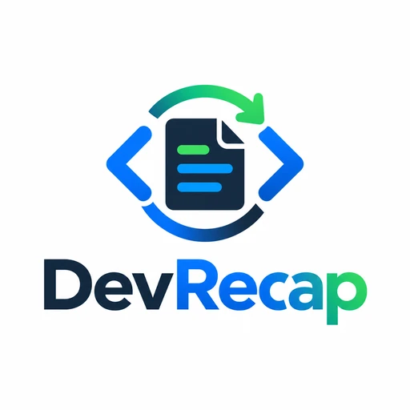

<p align="center">
  
</p>

<h1 align="center">DevRecap</h1>

<p align="center">
  <em>Your coding history already knows what you did. DevRecap turns it into a recap.</em>
</p>

<p align="center">
  
  
  
  
</p>

<p align="center">
  <strong>Codex + Claude + Git → evidence-backed developer recaps.</strong>
</p>

---

You know the question.

**“What did I actually work on this week?”**

Then you open GitHub, scroll through commits, search old terminal sessions, try to remember what was finished, what was only investigated, and what is still in progress.

DevRecap does that reconstruction for you.

It reads your local coding-agent history and Git activity, correlates the evidence, separates completed work from unfinished work, and turns the result into a presentation-ready recap.

**Not a timesheet. Not background monitoring. A recap you explicitly ask for when you need it.**

## The rule

> **Evidence first. If DevRecap cannot support a claim from the collected evidence, it must not present it as completed.**

A file edit is not automatically a finished feature.  
A command is not automatically a delivered fix.  
A conversation is not automatically proof that something shipped.

DevRecap combines session evidence with Git history and keeps uncertain work uncertain.

## Before / after

Without DevRecap:

```text
I think I worked on the PDF generation flow...
I also fixed something in the product-selection flow.
And I investigated a bit the issues with the reports.
```

With DevRecap:

```text
This week

Completed
• Improved the contract-generation flow and correlated the work with Git commits.
• Fixed frontend behavior in the product-selection journey.
• Investigated several issues with the reports generation.

In Progress
• New users creation (admin panel).
• Solving new issues with reports.

Technical areas
Vue · PDF · Node.js · Git
```

The goal is not to make your week sound busier.

The goal is to make it **accurate, useful, and easy to present**.

## How it works

```text
You ask for a recap
        ↓
DevRecap resolves the requested period
        ↓
Local Codex + Claude sessions
        +
Relevant Git repositories / commits
        ↓
Normalize events
        ↓
Group meaningful activities
        ↓
Correlate session activity with Git evidence
        ↓
Build an evidence-only analysis contract
        ↓
Coding agent analyzes the allowed facts
        ↓
Validate the analysis
        ↓
HTML report
        ↓
Optional PDF
```

The coding agent is the writing layer.

The DevRecap CLI is the factual layer.

That separation is intentional.

## Quick start

### Requirements

- **Node.js 24 LTS or newer**
- **Git**
- Optional: **Chrome / Chromium** for direct PDF generation

Clone the repository:

```bash
git clone https://github.com/jquinteiroo/devrecap.git
cd devrecap
npm run setup
```

Run DevRecap directly from the repository:

```bash
npm run recap -- "this week"
```

Or link the CLI globally while developing:

```bash
npm link
```

Then:

```bash
devrecap "this week"
```

The generated HTML report is written to `reports/`.

## Usage

Ask naturally:

```bash
devrecap "today"
```

```bash
devrecap "this week"
```

```bash
devrecap "last 7 days"
```

Choose a reporting style:

```bash
devrecap "this week" --style executive
```

```bash
devrecap "this week" --style technical
```

Control the amount of detail:

```bash
devrecap "last 14 days" --length detailed
```

Choose an exact period:

```bash
devrecap --from 2026-09-01 --to 2026-09-12
```

Generate HTML and request a PDF:

```bash
devrecap "this week" \
  --out reports/week.html \
  --pdf reports/week.pdf
```

Disable individual evidence sources when needed:

```bash
devrecap "this week" --no-claude
devrecap "this week" --no-codex
devrecap "this week" --no-git
```

## Use it as a skill

DevRecap ships with skill definitions for coding agents.

```text
.agents/skills/devrecap/
.claude/skills/devrecap/
```

When the skill is available to the agent, invoke DevRecap explicitly.

### Codex / agent skill

```text
$devrecap
```

Or ask for a specific recap:

```text
$devrecap this week
```

The skill follows an evidence-controlled workflow:

```text
devrecap prepare
      ↓
.devrecap/run.json
      ↓
agent analyzes contract.facts only
      ↓
.devrecap/analysis.json
      ↓
devrecap render
      ↓
report.html / report.pdf
```

The agent is instructed to:

- analyze only the facts exposed by DevRecap;
- reference valid activity IDs;
- never promote `in_progress`, `blocked`, or `unknown` work to completed;
- prefer outcomes, fixes, features, investigations, validation, blockers, and next steps over command-by-command narration;
- avoid exposing raw transcripts, credentials, or secrets.

## CLI workflow

### One command

For the deterministic flow:

```bash
devrecap "this week"
```

### Prepare

Collect and structure the evidence:

```bash
devrecap prepare \
  --request "this week" \
  --out .devrecap/run.json
```

`run.json` contains the structured report input, source counts, the evidence contract, and the prompt used by the skill.

### Analyze

When DevRecap is running as a skill, the coding agent reads the prepared contract and writes:

```text
.devrecap/analysis.json
```

Only evidence exposed through the contract should be used.

### Render

```bash
devrecap render \
  --run .devrecap/run.json \
  --analysis .devrecap/analysis.json \
  --out reports/devrecap.html
```

With PDF:

```bash
devrecap render \
  --run .devrecap/run.json \
  --analysis .devrecap/analysis.json \
  --out reports/devrecap.html \
  --pdf reports/devrecap.pdf
```

If Chrome or Chromium is not available, DevRecap keeps the print-ready HTML instead of failing the report.

## What DevRecap looks at

### Codex

DevRecap can collect local Codex session history inside the requested time range.

### Claude

Claude coding sessions can be included in the same recap, letting work performed across agents appear in one report.

### Git

DevRecap discovers relevant project directories and correlates session activity with Git commits.

Commit evidence is especially useful for distinguishing:

```text
worked on it
```

from:

```text
there is evidence that this work was completed
```

## What it does not do

DevRecap is **explicit-invocation only**.

It does not need to sit in the background watching everything you do.

No background productivity tracking.  
No hidden activity score.  
No fake certainty.

You ask for a recap. DevRecap reconstructs one from the available evidence.

## Report styles

| Style | Best for |
|---|---|
| `professional` | General work recaps and weekly reports |
| `executive` | Stakeholders, managers and higher-level summaries |
| `technical` | Engineering-focused reports with implementation context |
| `spoken` | Standups, demos and something you can read out loud |

Lengths:

```text
short
normal
detailed
```

Languages are inferred from the request, with support for English and Brazilian Portuguese in the CLI flow.

## Architecture

```text
devrecap/
├── .agents/
│   └── skills/
│       └── devrecap/
│           └── SKILL.md
│
├── .claude/
│   └── skills/
│       └── devrecap/
│
├── apps/
│   ├── cli/              # terminal interface
│   ├── server/           # local API / application server
│   └── web/              # web interface
│
├── packages/
│   ├── collectors/       # Codex, Claude and Git collection
│   ├── activity-engine/  # normalization, grouping and correlation
│   ├── report-engine/    # contracts, analysis validation and rendering
│   └── shared/           # shared types and utilities
│
├── tests/
├── scripts/
└── package.json
```

The runtime is intentionally lightweight and currently relies heavily on Node.js built-ins, including `node:sqlite`, `node:http`, `node:test`, `node:zlib`, and `fetch`.

## Why evidence matters

Developer activity is messy.

A single task may appear across:

- several Codex sessions;
- a Claude session;
- multiple files;
- failing tests;
- a later successful test;
- one or more Git commits.

A naive summary sees these as unrelated events.

DevRecap tries to reconstruct the **workstream**.

That makes the output more useful for:

- daily standups;
- weekly recaps;
- sprint reviews;
- performance reviews;
- project handoffs;
- personal work journals;
- remembering what happened after a long week.

## Development

Setup workspace links:

```bash
npm run setup
```

Run the CLI:

```bash
npm run recap -- "this week"
```

Run the local app:

```bash
npm run dev
```

Run the test suite:

```bash
npm test
```

Type-check:

```bash
npm run typecheck
```

Smoke test:

```bash
npm run smoke
```

## Principles

DevRecap is built around a few simple ideas:

1. **Evidence over memory.**
2. **Outcomes over command logs.**
3. **Uncertainty should stay uncertain.**
4. **Local development history is useful context, not a productivity score.**
5. **The agent should improve the writing — never invent the facts.**

## Contributing

Issues, ideas, integrations, report styles, collectors, and improvements are welcome.

If DevRecap becomes useful in your workflow, consider starring the repository. It helps other developers discover the project.

## License

MIT. [LICENSE](https://github.com/jquinteiroo/devrecap/blob/main/LICENSE)

---

<p align="center">
  <strong>You already did the work.</strong><br>
  DevRecap helps you remember what the evidence says you did.
</p>
